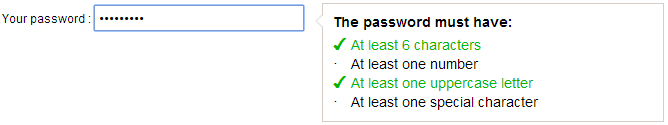

# jquery.passwordstrength.js

jQuery plugin to check the strength of a password.




## Installation

Include script after the jQuery library:

```<script src="/path/to/jquery.passwordstrength.js"></script>```

Also, include the CSS file's:

```<link rel="stylesheet" type="text/css" href="/path/to/jquery.passwordstrength.css">```


## How to use it

### Simple way

Just add this:

    <script>
        $(function(){
            $('input#pwd').passwordstrength();
        });
    </script>


### Options

| Option | Type | Default | Description |
| ------ | ---- | ------- | ----------- |
| **minlength** | `Int` | `8` | Minimum length of password |
| **number** | `Boolean` | `true` | Password requires at least one number |
| **capital** | `Boolean` | `true` | Password requires at least one uppercase letter |
| **special** | `Boolean` | `true` | Password requires at least one special character |

You can change the labels with the `labels` option :

- **general** : main label
- **minlength** : for the minimum length label's
- **number** : for the number label's
- **capital** : for the one uppercase letter label's
- **special** : for the one special character label's

Large example :

    <script>
        $(function(){
            $('input#pwd').passwordstrength({
                'minlength': 6,
                'number'   : true,
                'capital'  : true,
                'special'  : true,
                'labels'   : {
                    'general'   : 'Le mot de passe doit avoir :',
                    'minlength' : 'Au moins {{minlength}} caractères',
                    'number'    : 'Au moins un chiffre',
                    'capital'   : 'Au moins une lettre majuscule',
                    'special'   : 'Au moins un caractère spécial'
                }
            });
        });
    </script>
